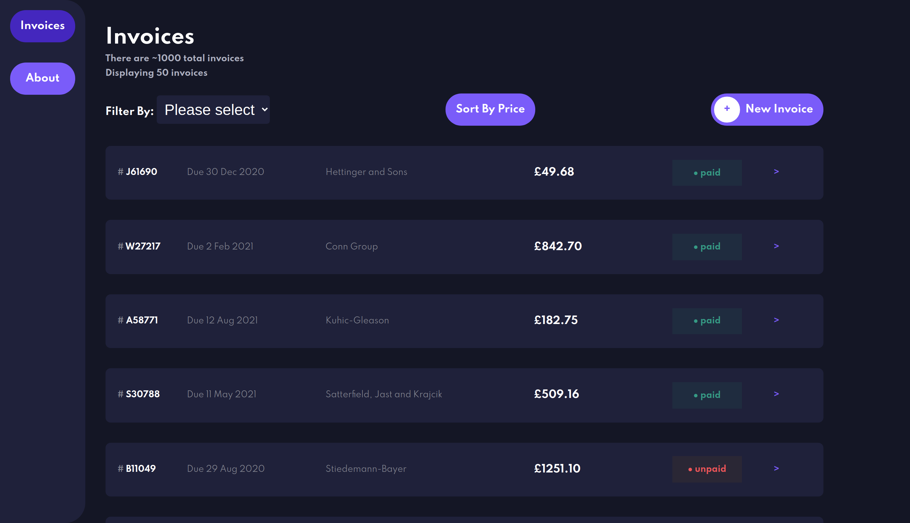
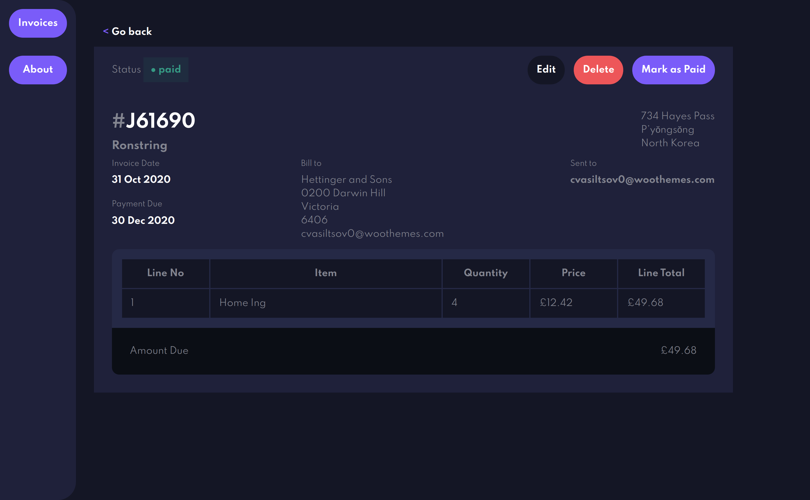

## Invoice Application

A general-purpose invoice application for storing and tracking invoices, incoming and outgoing. The main purpose of this project was to develop a full-stack application with MongoDB database, Node/Express back-end, and Vue front-end, with full crud operations. The application would be capable of displaying a list of invoices that can be filtered sorted and browsed in a variety of different ways.

I started by producing a data model of the information I was looking to store, I used Mongoose to produce an object model and handle Mongo database interaction. I then used express to create a simple API that was able to fetch a list of invoices and individual invoice details as well as update and delete existing data. This would have to be updated later to include some more useful features. I then started on the front-end by designing a simple user interface and separating out components for reusability of code. After creating the basic structure and styling I implemented some page animations using Vue's transition component. I then added some filtering and sorting functions as well as pagination to provide increased usability. I updated the API to handle these enhancements without breaking the existing endpoints.

I created a form using a number of different data types and UI elements, this would allow the user to add a new invoice as well as edit existing invoices. I used Vee-validate to provide form validation and yup to create a valid schema. I populated the database using mock data from Mockaroo

This project was designed to provide experience creating a feature-rich application using existing skills and expanding into new areas including: ODM, Logging, Validation, Unit & E2E Testing. It was also helpful to solidify my existing skills with TypeScript, Sass, Express, Jest & Vue bringing them together in 1 project from the ground up.

## Screenshots

#### Invoice List



#### Invoice Details



## Run Application

To run the application in development mode run the following from the root of the repo this will start the back-end and load the application in 'dev' mode.

```sh
npm run serve
```

To build for production run build process from client directory then run docker compose

```sh
cd invoice-client
npm run build
cd ..
docker-compose up
```
